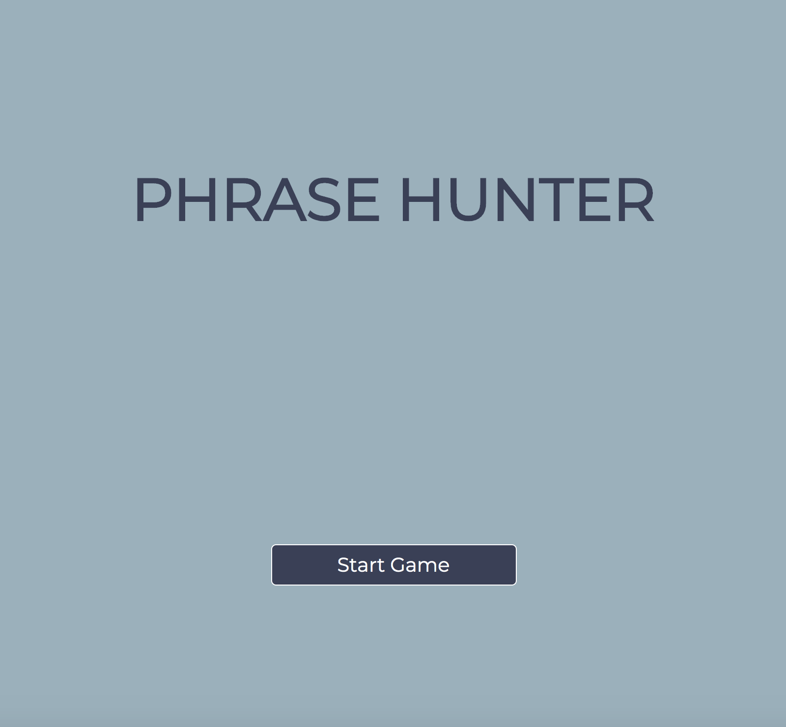
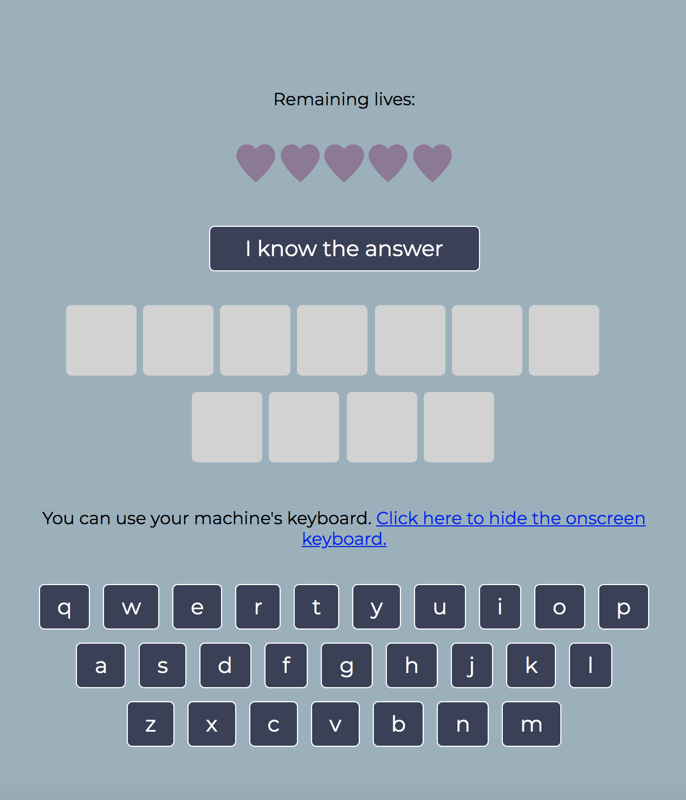
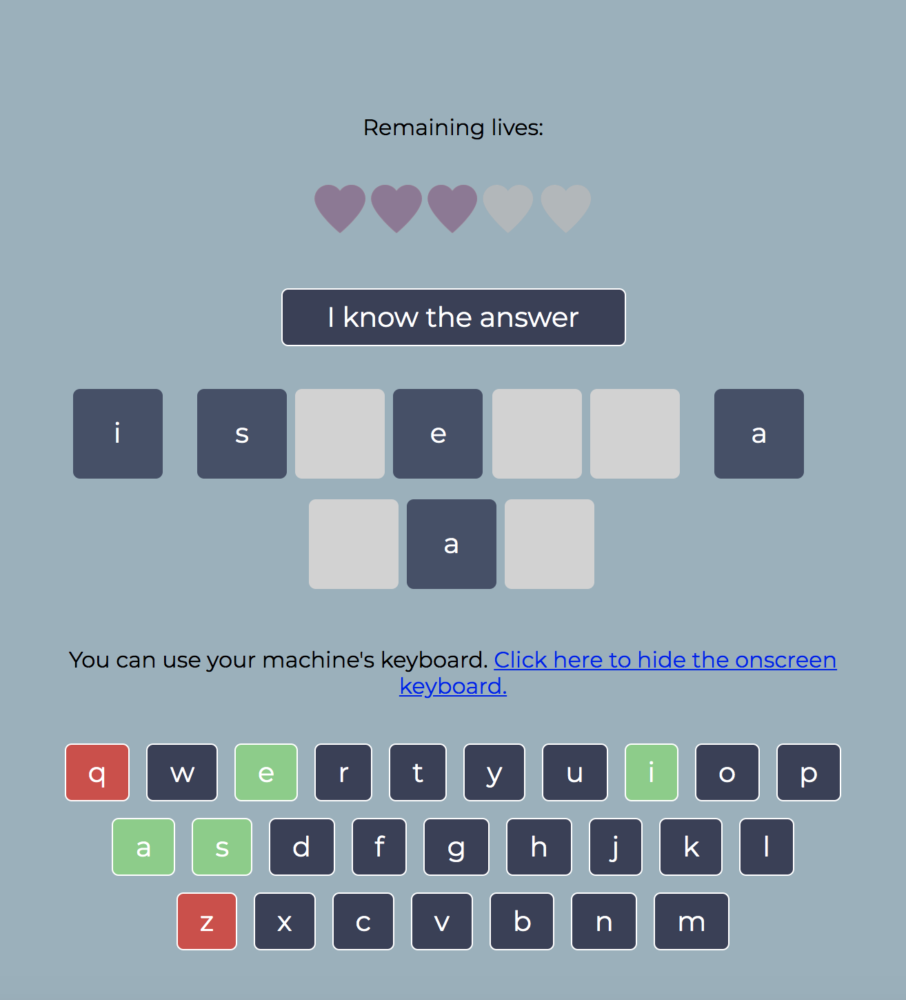
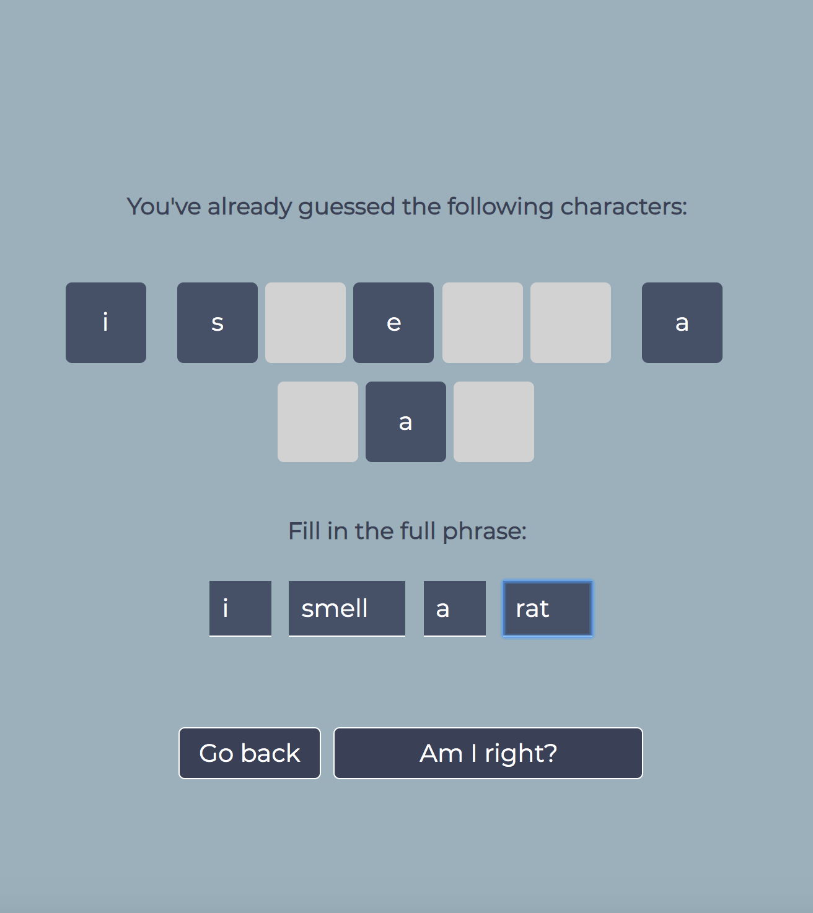
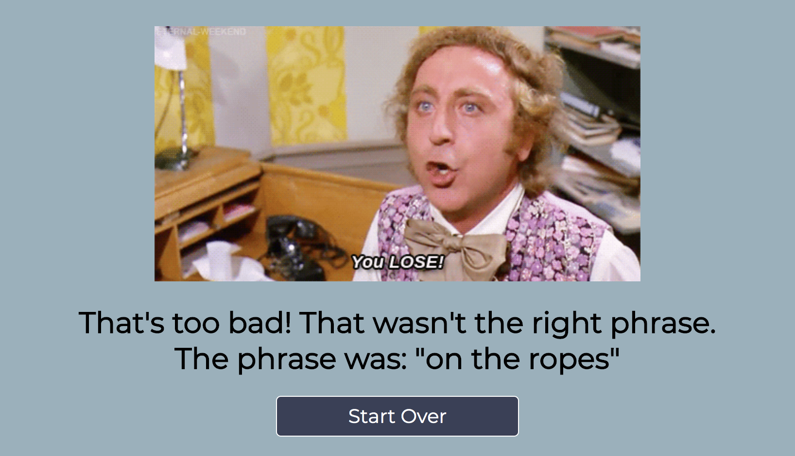
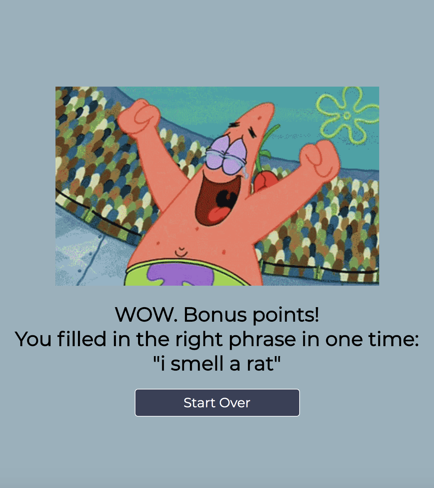
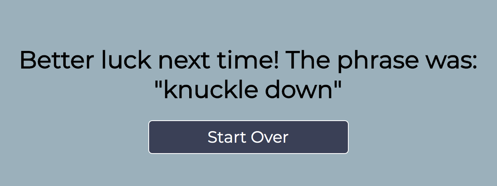
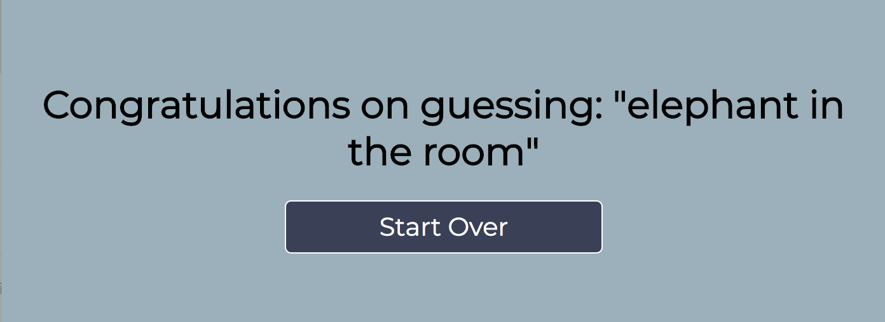

# A Hangman game app based on PHP, OOP & JavaScript
### PHP Team Treehouse TechDegree project #4

- [Understand the rules of the game](#understand-the-rules-of-the-game)
- [What the app does](#what-the-app-does)
- [Installation instructions](#installation-instructions)
- [Tech used](#tech-used)
- [Folder & file structure](#folder--file-structure)

## Understand the rules of the game
- The player’s goal is to guess all the letters in a hidden, random phrase. At the beginning, the player only sees the number of letters and words in the phrase, represented by blank boxes on the screen.
- The player presses the keys on his keyboard or clicks an onscreen keyboard to guess letters in the phrase.
- The letter is disabled on the onscreen keyboard and a player can't select that letter again.
- If the selected letter is in the phrase at least once, the letter and its position in the phrase is highlighted on-screen. All instances of the letter are made visible (so if there are 3 A's, all of the A's in the phrase appear at once).
- If the selected letter is not in the phrase, one of the player's hearts is removed from the screen.
- The player keeps choosing letters until they reveal all the letters in the phrase, or they make 5 incorrect guesses.
- If the player knows the answer, before guessing all letters, he/she can fill in the full phrase and earn bonus points!  

## What the app does
1. Main screen

2. New game

3. While playing

4. Guess full phrase

5. Incorrect full phrase

6. Correct full phrase

7. Guessed 5 incorrect characters

8. Guessed all correct characters

## Tech used
#### In this app the following main concepts & languages are applied:
PHP | OOP | JavaScript | HTML | CSS

## Folder & file structure
#### The most important folders & files within this project:

      .
      ├── css                         # contains the css files with the styles & animations                 
      ├── images                      # contains the images used
      ├── src                         # contains the config file and JavaScript files
      │   └── Classes                 # contains the Game & Phrase class files
      ├── index.html                  # start screen of the game
      └── play.php                    # the main file which controls the game
